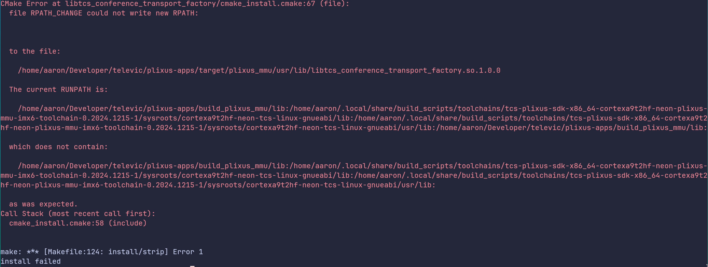
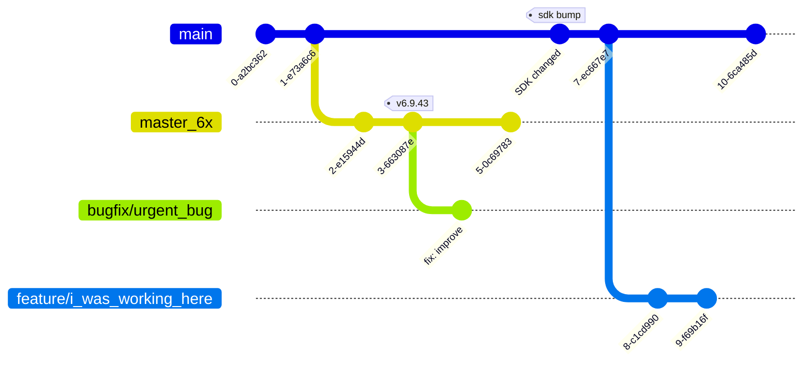
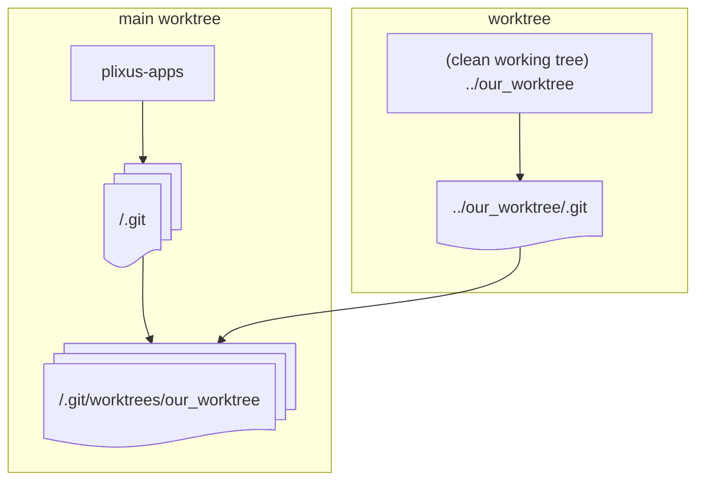

Problem
---
<!-- column_layout: [1, 1] -->
<!-- pause -->
<!-- column: 0 -->
# Overlapping build directory

<!-- pause -->
* plixus-apps r6 - r7 sdk mismatch



* buildroot / yocto
* linux-tcs

<!-- pause -->
<!-- column: 1 -->

# Urgent bugfix / pull request reviews


<!-- pause -->

```bash {4|5|9|10|4,11|12|4,11} 
# ...
# uncommitted changes in current directory
# ...
git stash
git checkout bugfix/urgent_bug
# ...
# fix the bug / review the pr / ...
# ...
build_scripts pc
git checkout feature/i_was_working_here
git stash pop
rm -rf build_pc
# resume work
```
<!-- incremental_lists: false -->

<!-- pause -->
<!-- end_slide -->

Problem
---

> [!CAUTION]
> Polluted working tree due to context switching



## Working tree
A directory containing all files tracked by git

<!-- end_slide -->


Solution: Git Worktrees
---

# Terminology
<!-- column_layout: [1, 2] -->
<!-- column: 0 -->
## Working tree
A directory containing all files tracked by git

<!-- pause -->

## .git directory 
Holds the repository's metadata

```bash +exec_replace
ls .git --color=always
```

<!-- pause -->
<!-- column: 1 -->
##  Worktree
Working tree + metadata
* typically one main worktree

```bash +exec_replace
ls -alh --color=always
```

<!-- end_slide -->

The manual
---

```bash +exec +acquire_terminal
man git-worktree
```

<!-- end_slide -->

Goal
---

* Create a new working tree
* That does not interfere with our current working tree

# Linked worktree

A worktree that links back to the original worktree / metadata.




<!-- end_slide -->

Git Worktrees Usage
---

<!-- column_layout: [1,1]-->
<!-- column: 1 -->
# git worktree -h
```bash +exec_replace
git worktree -h
```
<!-- pause -->
<!-- column: 0 -->

# Create a new worktree

```bash +exec
cd ~/Developer/televic/plixus-apps
/// git worktree remove our_new_worktree
/// rm -rf ../our_new_worktree
/// git worktree prune
/// git branch --delete our_new_worktree -f >/dev/null 2>&1 

git worktree add -b our_new_worktree ../our_new_worktree master_6x
```
<!-- end_slide -->
Git Worktrees Usage
---

```bash
git worktree add -b our_new_worktree ../our_new_worktree master_6x
```

## Result
<!-- column_layout: [1, 1] -->

<!-- column: 0 -->
```bash +exec
/// cd ~/Developer/televic/plixus-apps
git worktree list
```

<!-- column: 1 -->
```bash +exec
/// cd ~/Developer/televic/plixus-apps
git branch --color=always
```

<!-- pause -->
```bash +exec
/// cd ~/Developer/televic/plixus-apps
git rev-parse master_6x
git rev-parse our_new_worktree
```
<!-- reset_layout -->
<!-- pause -->
<!-- end_slide -->
Git Worktrees Usage
---

> [!CAUTION]
> A branch can only be checked out in one worktree

```bash +exec
/// cd ~/Developer/televic/plixus-apps
/// echo "`pwd`"
/// echo ""
git switch our_new_worktree
```
<!-- end_slide -->

<!-- jump_to_middle -->

Hands-on
---
