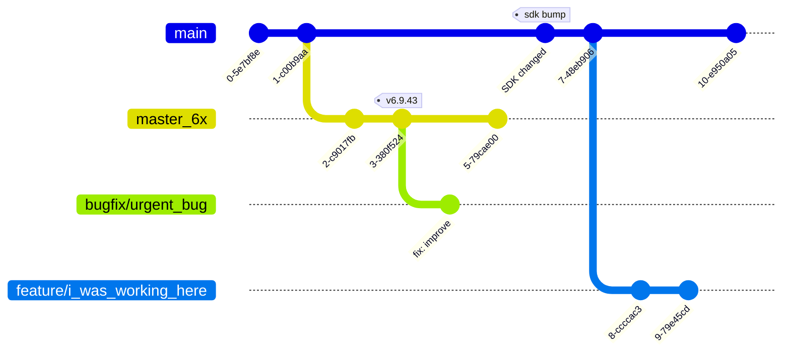

Problems
---
<!-- column_layout: [1, 1] -->
<!-- pause -->
<!-- column: 0 -->
Overlapping build directory
===
<!-- pause -->
* plixus-apps r6 - r7 sdk mismatch


<!-- pause -->
<!-- column: 1 -->

Urgent bugfix / pull request reviews
===

<!-- pause -->

```bash {4|5|9|10|4,11|12|4,11} 
# ...
# uncommitted changes in current directory
# ...
git stash
git checkout bugfix/urgent_bug
# ...
# fix the bug / review the pr / ...
# ...
build_scripts pc
git checkout feature/i_was_working_here
git stash pop
rm -rf build_pc
# resume work
```
<!-- incremental_lists: false -->

<!-- pause -->
<!-- reset_layout -->


<!-- end_slide -->


Git Worktrees
---

# RTFM

```bash +exec +acquire_terminal
man git-worktree
```

<!-- end_slide -->

Terminology
---

<!-- column_layout: [1, 1] -->

<!-- column: 0 -->
<!-- pause -->
# Working tree
A directory containing all files tracked by git

<!-- pause -->
# .git directory 
Holds the repository's metadata

```bash +exec_replace
ls .git --color=always
```

<!-- pause -->
<!-- column: 1 -->
# Worktree
Working tree + metadata
* typically one main worktree

```bash +exec_replace
ls -alh --color=always
```

<!-- end_slide -->


<!-- jump_to_middle -->
Git Worktrees Usage
===
<!-- end_slide -->

Goal
---

* Create a new working tree
* That does not interfere with our current working tree


<!-- end_slide -->

Git Worktrees Usage
---

# Now how?
```bash +exec_replace
git worktree -h
```

# Create a new worktree

```bash +exec
cd ~/Developer/televic/plixus-apps
/// rm -rf ../our_new_worktree
/// git worktree prune
/// git branch --delete new_branch >/dev/null 2>&1 
git branch --create new_branch
git worktree add --checkout ../our_new_worktree new_branch
```
<!-- pause -->

## Result
<!-- column_layout: [1, 1] -->

<!-- column: 0 -->
```bash +exec
/// cd ~/Developer/televic/plixus-apps
git worktree list
```

<!-- column: 1 -->
```bash +exec
/// cd ~/Developer/televic/plixus-apps
git branch
```
<!-- reset_layout -->
<!-- pause -->
## Consequence

```bash +exec
/// cd ~/Developer/televic/plixus-apps
git switch new_branch
```


<!-- end_slide -->

# What are branches?
